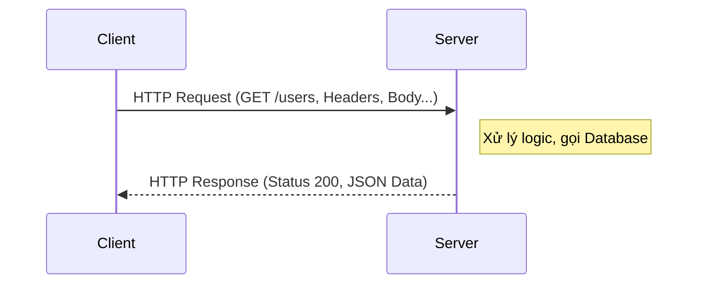

# 🚀 Buổi 3: RESTful API, HTTP Protocol & Router trong Express.js

Chào mừng các bạn đến với Buổi 3 của khóa học Backend Express.js! 👋 Trong buổi hôm nay, chúng ta sẽ đi sâu vào những khái niệm "xương sống" của việc giao tiếp trên môi trường mạng: **RESTful API**, **HTTP Protocol**, và cách quản lý tuyến đường với **Express Router**.

---

## 1. 🌐 RESTful API là gì?

### 1.1 Khái niệm
**API (Application Programming Interface)** giống như một người bồi bàn trong nhà hàng. Bạn (Client) đưa yêu cầu (Order) cho bồi bàn (API), bồi bàn mang yêu cầu vào nhà bếp (Server/Database) và mang món ăn (Data/Response) trả lại cho bạn.

**REST (REpresentational State Transfer)** là một kiểu kiến trúc phần mềm, quy định các tiêu chuẩn để các hệ thống trên web có thể giao tiếp với nhau một cách dễ dàng và đồng nhất. 

Một API được gọi là **RESTful API** khi nó tuân thủ các nguyên tắc của kiến trúc REST.

### 1.2 6 Nguyên tắc của REST
Để được coi là một hệ thống RESTful, nó phải tuân theo 6 ràng buộc sau:

1. **Client-Server Architecture**: Máy khách (Client) và máy chủ (Server) hoạt động hoàn toàn độc lập với nhau. Client chỉ lo phần giao diện người dùng, Server lo phần xử lý dữ liệu.
2. **Stateless (Không lưu trạng thái)**: Mỗi request từ Client gửi lên Server phải chứa đầy đủ thông tin để Server hiểu và xử lý. Server không lưu trữ bất kỳ thông tin nào về trạng thái của Client giữa các request.
3. **Cacheable (Khả năng lưu trữ bộ đệm)**: Các response từ Server phải được định nghĩa rõ ràng là có thể cache (lưu vào bộ nhớ tạm) hay không, giúp giảm tải cho Server và tăng tốc độ phản hồi.
4. **Uniform Interface (Giao diện đồng nhất)**: Cách thức giao tiếp giữa Client và Server phải tuân theo một quy chuẩn nhất định (thường là sử dụng các HTTP Methods chuẩn: GET, POST, PUT, DELETE,... và URL đồng nhất).
5. **Layered System (Hệ thống phân lớp)**: Hệ thống có thể có nhiều lớp (Load Balancer, Proxy, Database...) nhưng Client không cần biết nó đang kết nối với lớp nào.
6. **Code on Demand (Tùy chọn)**: Server có thể gửi mã thực thi (như JavaScript) cho Client để chạy tạm thời. (Rất ít khi dùng trong thực tế).

### 1.3 Tại sao nên dùng REST?
- **Dễ hiểu, dễ học**: Sử dụng chuẩn HTTP quen thuộc.
- **Tính linh hoạt**: Có thể trả về nhiều định dạng (phổ biến nhất là JSON).
- **Khả năng mở rộng tốt**: Nhờ tính chất Stateless, ta có thể dễ dàng scale hệ thống (thêm nhiều server).


---

## 2. 📨 HTTP Request & Response

Giao thức HTTP (HyperText Transfer Protocol) là nền tảng của giao tiếp dữ liệu trên Web. Nó bao gồm 2 thành phần chính: Request (Yêu cầu) và Response (Phản hồi).

### 2.1 HTTP Request (Từ Client gửi lên)
Một Request thường bao gồm các thành phần:

* **Method (Phương thức)**: Định nghĩa hành động muốn thực hiện (GET, POST, PUT, PATCH, DELETE).
* **URL/URI**: Địa chỉ tài nguyên (Endpoint).
* **Headers**: Chứa các thông tin siêu dữ liệu (Metadata) như: `Content-Type`, `Authorization` (Token), `User-Agent`...
* **Params / Query**: Các tham số truyền trên URL.
* **Body**: Dữ liệu gửi kèm (thường dùng trong POST, PUT, PATCH).

**Phân biệt Params, Query và Body:**

| Đặc điểm | Params (Path) 📍 | Query ❓ | Body 📦 |
|-----------|------------------|---------|---------|
| **Vị trí** | Nằm trong URL path | Sau dấu `?` trên URL | Nằm trong phần thân request (ẩn) |
| **Mục đích** | Xác định **một tài nguyên cụ thể** | **Lọc, tìm kiếm, phân trang** | **Gửi dữ liệu lớn/nhạy cảm** |
| **Ví dụ URL** | `/users/1` | `/users?age=20&sort=desc` | Không hiện trên URL |
| **Cách lấy trong Express** | `req.params.id` | `req.query.age` | `req.body.email` |
| **HTTP Methods** | GET, PUT, DELETE | GET (chủ yếu) | POST, PUT, PATCH |
| **Có thể bookmark?** | ✅ Có | ✅ Có | ❌ Không |
| **Bảo mật** | ⚠️ Hiện trên URL | ⚠️ Hiện trên URL | ✅ Ẩn trong request |

**Ví dụ thực tế với URL đầy đủ:**
```
# Params - Lấy user có id = 5
GET http://localhost:3000/users/5
→ req.params = { id: "5" }

# Query - Lấy danh sách users, lọc theo tuổi, sắp xếp giảm dần, trang 2
GET http://localhost:3000/users?age=20&sort=desc&page=2
→ req.query = { age: "20", sort: "desc", page: "2" }

# Body - Tạo user mới (gửi qua Postman hoặc Frontend)
POST http://localhost:3000/users
Content-Type: application/json
Body: { "name": "Minh", "email": "minh@gmail.com", "age": 22 }
→ req.body = { name: "Minh", email: "minh@gmail.com", age: 22 }
```

> [!TIP]
> Quy tắc nhớ nhanh: **Params** = "tôi muốn cái **này**" (cụ thể), **Query** = "tôi muốn **lọc/tìm**" (bổ sung), **Body** = "tôi muốn **gửi** dữ liệu" (tạo/sửa).

### 2.2 HTTP Response (Từ Server trả về)
Một Response thường bao gồm:
* **Status Code**: Mã trạng thái (VD: 200, 404, 500).
* **Headers**: Các thông tin đính kèm từ server.
* **Body**: Dữ liệu thực sự trả về (JSON, HTML, File...).



---

## 3. 🚦 HTTP Status Code (Mã trạng thái)

Status Code giúp Client hiểu được kết quả của Request mà không cần đọc chi tiết nội dung trả về. Chúng được chia làm 5 nhóm:

| Nhóm | Ý nghĩa | Ví dụ phổ biến |
|------|---------|----------------|
| **1xx** | Thông tin (Information) | `100 Continue` |
| **2xx** | Thành công (Success) | `200 OK` (Thành công chung), `201 Created` (Tạo mới thành công), `204 No Content` (Thành công nhưng không có dữ liệu trả về) |
| **3xx** | Chuyển hướng (Redirection) | `301 Moved Permanently`, `302 Found` |
| **4xx** | Lỗi từ phía Client (Client Error) | `400 Bad Request` (Gửi sai dữ liệu), `401 Unauthorized` (Chưa đăng nhập), `403 Forbidden` (Không có quyền), `404 Not Found` (Không tìm thấy tài nguyên) |
| **5xx** | Lỗi từ phía Server (Server Error) | `500 Internal Server Error` (Lỗi code trên server), `502 Bad Gateway`, `503 Service Unavailable` |

---

## 4. 📝 Chuẩn hóa Response (Response Formatting)

### 4.1 Tại sao cần chuẩn hóa?
Thử tưởng tượng nếu 1 API trả về data trần `[{"name": "A"}]`, 1 API khác lại trả về `{"data": [...], "msg": "ok"}`, Client sẽ rất vất vả để biết lúc nào thành công, lúc nào thất bại, và lấy data ở đâu. Việc chuẩn hóa giúp Frontend/Mobile dễ dàng xử lý mọi API theo một quy trình duy nhất.

### 4.2 Phân tích code Response của dự án hiện tại
Hãy xem file `src/controller/users.controller.js` trong project của chúng ta:

```javascript
// Trích đoạn src/controller/users.controller.js
export const getUserById = async (req, res) => {
    const userId = req.params.id;
    try {
        const user = await usersService.getUserById(userId);
        if (!user) {
            // Chuẩn Error 404
            return res.status(404).json({
                success: false,
                message: 'User not found'
            });
        }
        // Chuẩn Success 200
        res.status(200).json({
            success: true,
            message: 'User retrieved successfully',
            data: user
        });
    } catch (error) {
        // Chuẩn Error 500
        res.status(500).json({ 
            success: false, 
            message: 'Internal server error',
            error: error.message
        });
    }
}
```

👉 **Nhận xét form chuẩn hóa của project:**
Dự án của chúng ta đang sử dụng một form rất chuẩn chỉ:
1. `success` (boolean): Giúp Client nhận biết ngay là call API có thành công về mặt logic hay không.
2. `message` (string): Thông báo cho user hoặc dev biết chuyện gì đã xảy ra.
3. `data` (any): (Chỉ xuất hiện khi success: true) Chứa dữ liệu thực tế.
4. `error` (any): (Chỉ xuất hiện khi success: false, ở lỗi 500) Chứa chi tiết lỗi hệ thống.

---

## 5. 🔀 Router trong Express

### 5.1 Router là gì?
Nếu viết tất cả các route (`app.get`, `app.post`...) trong file `index.js`, file này sẽ dài đến hàng ngàn dòng, rất khó maintain. 
**Router** trong Express giúp chúng ta nhóm các routes có liên quan lại với nhau thành các module nhỏ gọn.

### 5.2 Phân tích thiết kế Router của project

Project của chúng ta được thiết kế rất thông minh theo mô hình phân cấp:

**Cấp 1: File gốc `src/index.js`**
```javascript
import router from "./route/route.js";
// ...
app.use("/", router);
```
Mọi request gửi đến `/` đều được giao cho `router` chính xử lý.

**Cấp 2: Master Router `src/route/route.js`**
```javascript
import userRouter from './users.route.js';
import { Router } from 'express';

const router = Router();
// Phân luồng: Nếu request bắt đầu bằng /users, đưa cho userRouter xử lý
router.use('/users', userRouter);

export default router;
```
File này đóng vai trò như một "trạm trung chuyển", điều phối đến các module cụ thể (users, products, orders...).

**Cấp 3: Module Router `src/route/users.route.js`**
```javascript
import { Router } from "express";
import * as userController from "../controller/users.controller.js";

const router = Router();

// Bản chất là /users/
router.get("/", userController.getAllUsers);

// Bản chất là /users/:id/
router.get("/:id/", userController.getUserById);

router.post("/", userController.createUser);
router.post("/forgot-password", userController.forgotPassword);

export default router;
```
Nhờ cách chia này, endpoint thực tế sẽ là: `GET http://localhost:3000/users` hoặc `GET http://localhost:3000/users/1`. Code rất gọn gàng và dễ đọc!

---

## 6. 🛠️ Phân tích Coding (Endpoint & Params/Body)

Dựa trên code hiện tại, ta thấy sự phân biệt rõ ràng:

* **Sử dụng Params:**
Trong `getUserById`, ta cần lấy 1 user cụ thể dựa vào ID.
URL: `/users/1`
```javascript
// Lấy giá trị '1' thông qua req.params
const userId = req.params.id; 
const user = await usersService.getUserById(userId);
```

* **Sử dụng Method cho các mục đích khác nhau:**
Cùng là `/users`, nhưng:
- `GET /users` -> Lấy danh sách (Gọi `getAllUsers`).
- `POST /users` -> Tạo mới (Gọi `createUser`).
Đây chính là tinh thần của **RESTful API**: Dùng HTTP Methods để xác định hành động thay vì viết URL dài dòng như `/users/create`, `/users/getAll`.

---

## 7. 📐 Thiết Kế Endpoint RESTful Chuẩn & Chọn Status Code Phù Hợp

Đây là phần rất quan trọng cho việc thiết kế API trong thực tế. Hãy xem bảng mapping chuẩn cho CRUD operations:

### 7.1. RESTful Endpoint Convention

| Hành động | HTTP Method | Endpoint | Mô tả |
|-----------|-------------|----------|-------|
| Lấy tất cả | `GET` | `/users` | Trả về danh sách users |
| Lấy theo ID | `GET` | `/users/:id` | Trả về 1 user cụ thể |
| Tạo mới | `POST` | `/users` | Tạo user mới |
| Cập nhật toàn bộ | `PUT` | `/users/:id` | Thay thế toàn bộ thông tin user |
| Cập nhật một phần | `PATCH` | `/users/:id` | Sửa một vài field (VD: đổi email) |
| Xóa | `DELETE` | `/users/:id` | Xóa user |

> [!IMPORTANT]
> **Quy tắc đặt tên endpoint:**
> - Dùng **danh từ số nhiều** (✅ `/users`, ❌ `/user`, ❌ `/getUsers`)
> - Dùng **kebab-case** cho URL nhiều từ (✅ `/forgot-password`, ❌ `/forgotPassword`)
> - **KHÔNG** đặt hành động trong URL (❌ `/users/delete/1`, ✅ `DELETE /users/1`)

### 7.2. Chọn Status Code phù hợp cho từng Endpoint

Dựa trên các endpoint trong project của chúng ta:

| Endpoint | Thành công | Không tìm thấy | Lỗi dữ liệu | Lỗi server |
|----------|-----------|-----------------|--------------|------------|
| `GET /users` | `200 OK` | - | - | `500` |
| `GET /users/:id` | `200 OK` | `404 Not Found` | - | `500` |
| `POST /users` | `201 Created` | - | `400 Bad Request` | `500` |
| `PUT /users/:id` | `200 OK` | `404 Not Found` | `400 Bad Request` | `500` |
| `DELETE /users/:id` | `200 OK` hoặc `204 No Content` | `404 Not Found` | - | `500` |

### 7.3. Phân tích Endpoint của project hiện tại

```javascript
// src/route/users.route.js
router.get("/", userController.getAllUsers);         // ✅ Chuẩn RESTful
router.get("/:id/", userController.getUserById);     // ✅ Chuẩn RESTful
router.post("/", userController.createUser);          // ✅ Chuẩn RESTful
router.post("/forgot-password", userController.forgotPassword); // ✅ Đây là action đặc biệt, 
                                                     // không phải CRUD nên dùng POST là hợp lý
```

> [!NOTE]
> Endpoint `/forgot-password` không thuộc CRUD truyền thống. Đối với các **action đặc biệt** như quên mật khẩu, đổi mật khẩu, đăng nhập,... ta thường dùng `POST` và đặt tên mô tả hành động. Đây là cách làm phổ biến và hoàn toàn chấp nhận được.

---

## 8. 🌟 Kiến thức mở rộng (Optional)

Dù REST rất phổ biến, nhưng thế giới công nghệ còn nhiều lựa chọn khác:

| Công nghệ | Đặc điểm nổi bật | Khi nào nên dùng? |
|-----------|------------------|-------------------|
| **REST** | Chuẩn hóa, dễ hiểu, dùng HTTP cache | Đa số các ứng dụng Web/Mobile thông thường. |
| **GraphQL** | Client có thể yêu cầu chính xác những data mình cần (không dư, không thiếu) | Dự án có UI phức tạp, cần lấy nhiều data lồng nhau trong 1 request. |
| **gRPC** | Cực kỳ nhanh, dùng Protobuf, giao tiếp nhị phân | Giao tiếp giữa các Microservices nội bộ với nhau. |
| **Webhook**| Server chủ động gọi Client khi có sự kiện (Event-driven) | Thanh toán xong (VNPAY gọi lại báo kết quả), bot chat... |

---

## 📌 Tóm tắt Buổi 3

1. **RESTful API** là tiêu chuẩn giao tiếp, sử dụng HTTP Methods và URL đồng nhất.
2. **HTTP Request** mang thông điệp từ Client (Method, Params, Query, Body). **HTTP Response** là câu trả lời của Server (Status Code, Data).
3. **Params** dùng để xác định tài nguyên cụ thể, **Query** để lọc/tìm kiếm, **Body** để gửi dữ liệu.
4. **Status Code** (200, 201, 400, 404, 500) giúp hiểu nhanh kết quả của Request.
5. Việc **chuẩn hóa JSON Response** (có format chung: success, message, data) là bắt buộc để dự án chuyên nghiệp.
6. **Express Router** giúp chia nhỏ và tổ chức code routing khoa học, rành mạch.
7. Thiết kế endpoint tuân thủ **RESTful Convention** (danh từ số nhiều, kebab-case, dùng HTTP Method thay vì đặt tên hành động trong URL).

*Hãy đọc lại code project, chạy thử các API qua Postman và xem sự kì diệu của REST nhé! Chúc các bạn học tốt!* 🚀🔥
