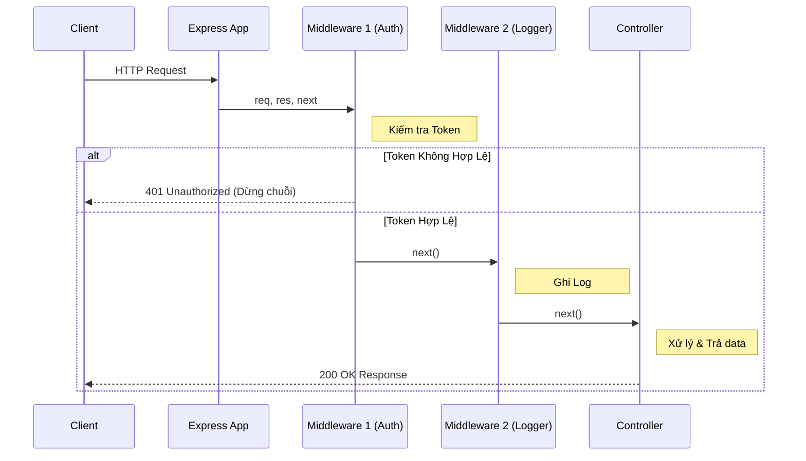
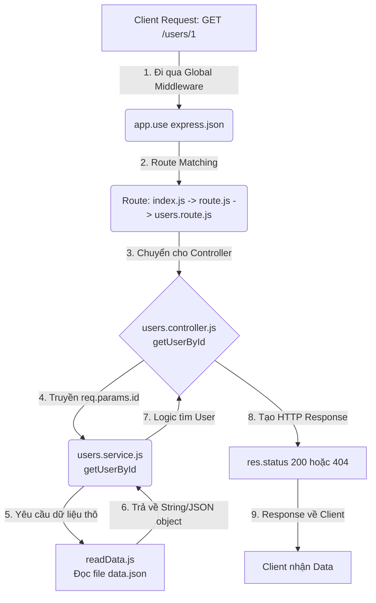

# 🚀 Buổi 4: Kiến Trúc 3 Lớp - Controller, Middleware và Service trong Express.js

Chào mừng các bạn đến với Buổi 4! Hôm nay chúng ta sẽ đi sâu vào một trong những nguyên tắc quan trọng nhất khi xây dựng backend: **Phân chia trách nhiệm (Separation of Concerns)**. Chúng ta sẽ tìm hiểu cách chia một ứng dụng Express.js thành các tầng riêng biệt: Router, Middleware, Controller và Service.


---

## 1. Controller là gì? 🎮

### 1.1. Khái niệm cơ bản
**Controller** (Bộ điều khiển) là tầng tiếp nhận yêu cầu (Request) từ client sau khi nó đã đi qua Router và Middleware. Trách nhiệm duy nhất của Controller là:
- Lấy dữ liệu từ Request (`req.params`, `req.query`, `req.body`)
- Gọi xuống tầng Service để xử lý nghiệp vụ
- Trả kết quả về cho client qua Response (`res.send`, `res.json`, `res.status`)

> [!NOTE]
> Controller **KHÔNG NÊN** chứa business logic (logic nghiệp vụ) phức tạp. Nó chỉ giống như một người điều phối viên (Traffic Cop) - nhận thông tin, giao cho người khác xử lý, và trả kết quả lại.

### 1.2. Phân tích code hiện tại (`users.controller.js`)

Hãy xem cách Controller được viết trong dự án của chúng ta:

```javascript
// src/controller/users.controller.js
import * as usersService from '../service/users.service.js';

export const getUserById = async (req, res) => {
    // 1. Nhận dữ liệu từ request
    const userId = req.params.id;
    try {
        // 2. Gọi tầng Service xử lý
        const user = await usersService.getUserById(userId);
        
        // 3. Chuẩn bị response trả về
        if (!user) {
            return res.status(404).json({
                success: false,
                message: 'User not found'
            });
        }
        res.status(200).json({
            success: true,
            message: 'User retrieved successfully',
            data: user
        });
    } catch (error) {
        // 4. Bắt lỗi và trả về lỗi 500
        res.status(500).json({ 
            success: false, 
            message: 'Internal server error',
            error: error.message
        });
    }
}
```
Nhìn vào hàm `getUserById`, nó hoàn thành xuất sắc vai trò của một Controller: chỉ điều phối luồng đi của dữ liệu mà không quan tâm bên dưới file JSON được đọc như thế nào.

---

## 2. Middleware là gì? Cách hoạt động 🕵️‍♂️

### 2.1. Khái niệm Middleware
**Middleware** là các hàm được thực thi tuần tự trong vòng đời của một request. Nó đứng giữa (middle) lúc Request tới Server và lúc Controller xử lý trả về Response.

Khi có 1 request đi vào, nó sẽ đi qua 1 chuỗi các Middleware. Mỗi Middleware có thể:
1. Thực thi bất kỳ đoạn code nào.
2. Thay đổi đối tượng `req` và `res`.
3. Kết thúc chu trình request-response (bằng cách dùng `res.send()` hoặc `res.json()`).
4. Gọi hàm `next()` để chuyển quyền kiểm soát cho middleware tiếp theo trong chuỗi.

### 2.2. Diagram luồng hoạt động của Middleware



### 2.3. Các ví dụ về Middleware (Lý thuyết)
Mặc dù project của chúng ta chưa implement middleware custom phức tạp, nhưng chúng ta đã dùng middleware built-in của Express:
```javascript
// src/index.js
app.use(express.json()); // Middleware phân tích body dạng JSON
app.use("/", router); // Router cũng hoạt động như một chuỗi middleware
```

**Ví dụ về một Middleware logging (như thư viện Morgan):**
Morgan là một middleware phổ biến giúp ghi log mọi request đến server. Nếu tự viết một bản đơn giản, nó sẽ trông như sau:
```javascript
const loggerMiddleware = (req, res, next) => {
    console.log(`[${new Date().toISOString()}] ${req.method} ${req.url}`);
    next(); // Rất quan trọng! Nếu không gọi next(), request sẽ bị treo
};
```

**Ví dụ về Error Handler Middleware cơ bản:**
Error handler là một loại middleware đặc biệt ở cuối chuỗi, có 4 tham số `(err, req, res, next)`. Nó bắt mọi lỗi xảy ra trong ứng dụng.
```javascript
const errorHandler = (err, req, res, next) => {
    console.error("Lỗi rồi bạn ơi: ", err.stack);
    res.status(500).json({ success: false, message: 'Đã có lỗi xảy ra!' });
};
```

---

## 3. Vì sao phải sử dụng Controller và Middleware? 🧐

Tại sao không viết tất cả trong một file `index.js`? Hãy cùng xem bảng so sánh:

| Tiêu chí | Viết gộp (Không dùng mô hình) | Tách file (Có Controller/Middleware) |
|----------|-------------------------------|--------------------------------------|
| **Dễ đọc (Readability)** | Khó, file `index.js` sẽ dài hàng ngàn dòng. | Dễ đọc, mỗi file đảm nhận một chức năng cụ thể. |
| **Bảo trì (Maintainability)**| Sửa một chỗ rất dễ làm hỏng logic chỗ khác. | Sửa lỗi dễ dàng, khoanh vùng được nơi xảy ra lỗi. |
| **Tái sử dụng (Reusability)**| Không thể hoặc rất khó copy code. | Dễ dàng dùng lại middleware (ví dụ Auth) cho nhiều route. |
| **Kiểm thử (Testing)** | Cực kỳ khó viết Unit Test do dính liền `req`/`res`. | Có thể test riêng rẽ Controller, Service độc lập. |

Việc tách biệt giúp chúng ta tuân thủ nguyên lý **Single Responsibility Principle (SRP)** - Mỗi module chỉ nên có một lý do để thay đổi.

---

## 4. Service Layer nên chứa gì? 🏭

### 4.1. Khái niệm Business Logic và Service Layer
**Service Layer** là trái tim của ứng dụng. Nó chứa **Business Logic** (Quy tắc nghiệp vụ). 
- **Business logic** là những quy định, thuật toán, phép toán xử lý dữ liệu đặc thù của ứng dụng (Ví dụ: Tính tiền lãi ngân hàng, kiểm tra giỏ hàng có hợp lệ không, thay đổi format dữ liệu trả về, v.v.).
- Tầng Service nhận dữ liệu từ Controller, xử lý theo quy tắc, tương tác với Database (qua Repository) và trả kết quả ngược lại cho Controller.

### 4.2. Phân tích `users.service.js`

```javascript
// src/service/users.service.js
import { readData } from "../repository/readData.js";

export const getUserById = async (userId) => {
  try {
    // Tương tác với Repository để lấy dữ liệu thô
    const data = await readData();
    
    // Business Logic: Tìm kiếm user có ID tương ứng và format dữ liệu
    const user = data.users.find(user => user.id === parseInt(userId));
    
    return user || null;
  } catch (error) {
    console.error(`Error fetching user with ID ${userId}:`, error);
    throw error; // Ném lỗi ngược lên Controller để xử lý (trả ra HTTP 500)
  }
}
```
Ở đây, logic `data.users.find(...)` được đặt ở Service. Nếu sau này có yêu cầu thêm logic (như: User phải có trạng thái 'active' thì mới trả về), ta sẽ chỉ cần sửa đổi tại Service mà không cần đụng đến Controller, và Controller cũng không cần biết dữ liệu được lấy từ JSON hay SQL.

---

## 5. Phân Tích Luồng Hoạt Động Của Dự Án Của Bạn 🔄

Hãy xem vòng đời của một Request khi người dùng gọi API `GET /users/1`:



### Cách project của bạn đã tổ chức cấu trúc phân tầng (Layered Architecture):
Dự án của bạn đã tuân thủ kiến trúc nhiều lớp rất xuất sắc:
1. **Entry Point (`index.js`)**: Nơi khởi tạo ứng dụng, khai báo Global Middleware, và kết nối với Master Router. Không hề có logic phức tạp ở đây.
2. **Router (`route.js`, `users.route.js`)**: Chỉ làm nhiệm vụ định tuyến (mapping) URL với HTTP Method (`GET`, `POST`) sang một Controller tương ứng. Code rất sạch sẽ.
3. **Controller (`users.controller.js`)**: Xử lý HTTP Object (`req`, `res`). Validate request cơ bản, gọi Service, bắt lỗi tổng (`try/catch`) và trả HTTP status code.
4. **Service (`users.service.js`)**: Tập trung vào Business logic, hoàn toàn không dính dáng tới `req` hay `res`. Điều này giúp Service có thể gọi được từ mọi nơi (kể cả từ một script cron job chạy ngầm, không qua web).
5. **Repository (`readData.js`)**: Đảm nhiệm việc giao tiếp với nguồn dữ liệu (Data Source). Ở đây là file `data.json`, sau này nếu đổi sang MongoDB hay MySQL, ta chỉ cần viết lại tầng này mà Service không hề hay biết!

---

## 6. Tổng Kết 📌

Để dễ nhớ, bạn có thể hình dung ứng dụng như một nhà hàng:
- **Middleware** là bác bảo vệ kiểm tra vé ở cửa (Check Auth, Ghi Log...).
- **Router** là cô lễ tân chỉ đường cho khách vào đúng bàn.
- **Controller** là bạn phục vụ bàn, nhận order (`Request`), chuyển cho bếp và mang thức ăn ra (`Response`).
- **Service** là đầu bếp, nấu nướng và xử lý món ăn (Business Logic).
- **Repository** là người đi chợ, lấy nguyên liệu từ kho (`Database`/File).

Việc áp dụng kiến trúc này giúp code của bạn **Dễ bảo trì - Dễ mở rộng - Dễ kiểm thử**. Hãy giữ vững tư duy này trong suốt hành trình trở thành Backend Developer nhé! 🚀
