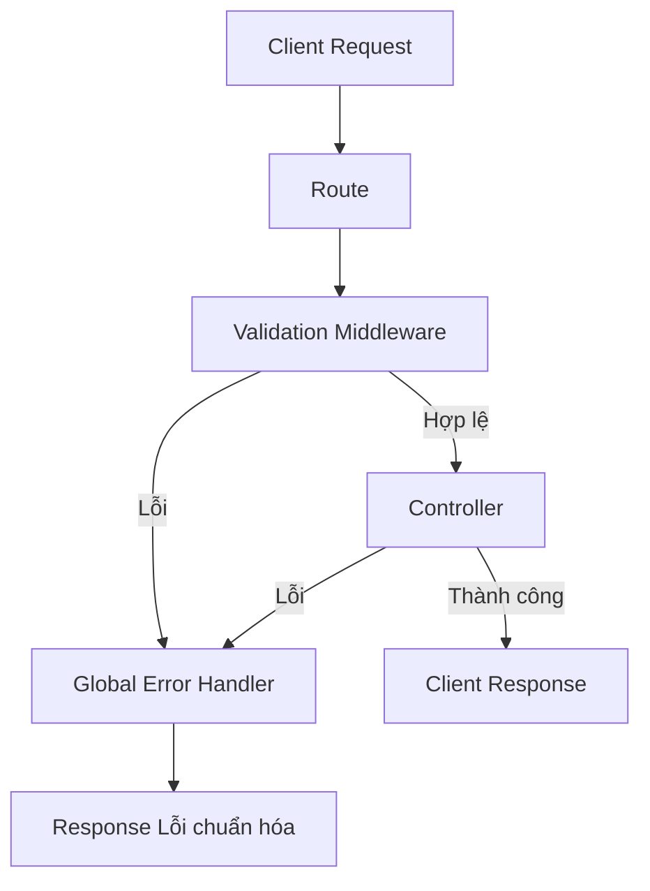

# 🚀 Buổi 5: Helper, Validation và Chuẩn Hóa Xử Lý Lỗi (Error Handling) trong Express.js

Chào mừng các bạn đến với Buổi 5 của khóa học Backend Express.js! 🎉

Trong các buổi trước, chúng ta đã xây dựng được cấu trúc cơ bản của ứng dụng với Controller, Service, Route và Repository. Ứng dụng đã có thể xử lý logic lấy dữ liệu. Tuy nhiên, một hệ thống mạnh mẽ thì cần phải kiểm tra chặt chẽ dữ liệu đầu vào, xử lý các tác vụ phụ trợ tốt và phải báo lỗi thật "chuyên nghiệp" khi có sự cố.

Hôm nay, chúng ta sẽ cùng tìm hiểu về **Helper**, **Validation** và **Chuẩn hóa Error Handling** nhé! 🎯

---

## 🛠️ 1. Helper Function: Trợ thủ đắc lực

### Helper Function là gì?
**Helper function** (hàm hỗ trợ) là những hàm nhỏ, độc lập, thực hiện một nhiệm vụ cụ thể, có thể tái sử dụng ở nhiều nơi trong dự án. Chúng giống như những công cụ nhỏ trong hộp đồ nghề của bạn (ví dụ: búa, cờ lê) - không chứa logic nghiệp vụ phức tạp, nhưng rất cần thiết để xử lý các công việc lặp đi lặp lại.

### Khi nào nên dùng Helper?
Bạn nên tạo ra một helper khi:
- Một đoạn code (logic tính toán, định dạng dữ liệu) xuất hiện ở 2 nơi trở lên.
- Bạn muốn làm cho Controller hay Service trở nên gọn gàng và dễ đọc hơn bằng cách tách bớt các xử lý kỹ thuật (không dính dáng đến database hay API ngoài) ra chỗ khác.

**Ví dụ thực tế:**
- Hàm hash (mã hóa) mật khẩu.
- Hàm format ngày tháng năm.
- Hàm tạo chuỗi ngẫu nhiên (random string) cho token.

### So sánh Helper vs Service vs Middleware

| Đặc điểm | Helper 🛠️ | Service 🧠 | Middleware 🚦 |
| :--- | :--- | :--- | :--- |
| **Nhiệm vụ chính** | Thực hiện một tính toán/định dạng độc lập, không giữ trạng thái. | Chứa logic nghiệp vụ (business logic), giao tiếp với Repository/Database. | Chặn giữa Request và Response để kiểm tra, thay đổi dữ liệu hoặc báo lỗi. |
| **Input / Output** | Nhận tham số bình thường, trả về kết quả. | Nhận tham số, xử lý logic, có thể gọi DB. | Nhận `(req, res, next)`, quyết định có cho đi tiếp (`next`) hay dừng lại. |
| **Sự phụ thuộc** | Không phụ thuộc vào req/res của Express. | Phụ thuộc vào model/repository. | Phụ thuộc chặt chẽ vào Express routing. |

---

## 🛡️ 2. Validation: Người gác cổng nghiêm ngặt

### Tại sao cần Validation?
"Đừng bao giờ tin tưởng dữ liệu từ người dùng!" - Đây là câu thần chú của mọi lập trình viên Backend. 

Nếu chúng ta để dữ liệu rác (hoặc dữ liệu độc hại) lọt vào cơ sở dữ liệu hoặc logic nghiệp vụ, ứng dụng có thể bị lỗi, sập (crash) hoặc bị tấn công (như SQL Injection).

### Validate ở đâu là hợp lý nhất?
Thường chúng ta sẽ thực hiện validate ngay từ "cửa ngõ" - tức là trước khi request kịp chạm đến Controller. Chúng ta sử dụng **Middleware** để làm việc này.

### Các loại Validation phổ biến:
1. **Input Validation (Kiểm tra định dạng)**: 
   - Email có đúng chuẩn `@gmail.com` không?
   - Tuổi có phải là số nguyên dương không?
   - Password có đủ 8 ký tự, chữ hoa, chữ thường không?
2. **Business Rule Validation (Kiểm tra nghiệp vụ)**:
   - User này đã tồn tại trong hệ thống chưa?
   - Số dư tài khoản có đủ để thực hiện giao dịch không? (Cái này thường nằm ở Service).

---

## 🚨 3. Quy tắc Chuẩn Hóa Xử Lý Lỗi (Error Handling)

Một API tốt là một API mà khi thành công thì trả về kết quả rõ ràng, và khi thất bại thì báo lỗi một cách chi tiết, có cấu trúc đồng nhất.

### Vấn đề của việc phản hồi lỗi "chắp vá"
Nếu mỗi Controller bạn tự nghĩ ra một cấu trúc JSON để trả lỗi, Front-end sẽ rất khổ sở vì không biết phải parse (đọc) lỗi như thế nào.

### Quy chuẩn Error Response Format
Chúng ta nên quy định một cấu trúc chung cho mọi lỗi. Ví dụ:
```json
{
  "success": false,
  "status": 400,
  "message": "Dữ liệu đầu vào không hợp lệ",
  "errors": [
     { "field": "email", "message": "Email không đúng định dạng" }
  ]
}
```

### Mã lỗi HTTP (HTTP Error Code Mapping)
Hãy sử dụng đúng mã HTTP để mô tả lỗi:
- `400 Bad Request`: Lỗi do người dùng gửi sai dữ liệu (Validation error).
- `401 Unauthorized`: Chưa đăng nhập (Thiếu token).
- `403 Forbidden`: Đã đăng nhập nhưng không có quyền truy cập.
- `404 Not Found`: Không tìm thấy tài nguyên.
- `500 Internal Server Error`: Lỗi do server (ví dụ: DB sập, code lỗi).

---

## 🔍 4. Phân tích Code Hiện Tại

Hãy cùng xem xét đoạn code trong file `src/controller/users.controller.js` của chúng ta:

```javascript
export const getAllUsers = async (req, res) => {
    try {
        const users = await usersService.getAllUsers();
        res.status(200).json({
            success: true,
            message: 'Users retrieved successfully',
            data: users
        });
    } catch (error) {
        res.status(500).json({ 
            success: false, 
            message: 'Internal server error',
            error: error.message
        });
    }
}
```

### Phân tích các vấn đề cần cải thiện:

1. **Try/Catch Pattern bị lặp lại (Boilerplate code):**
   Trong mọi hàm controller, bạn đang phải viết `try { ... } catch (error) { res.status(500)... }`. Nếu có 100 API, bạn sẽ phải viết 100 cụm `try/catch` này. Điều này làm code dài dòng và khó bảo trì.

2. **Lặp code cấu trúc Response:**
   Đoạn code `res.status(...).json({ success: ..., message: ... })` xuất hiện liên tục. Chúng ta có thể tạo ra các **Helper functions** để chuẩn hóa việc trả về kết quả thành công và thất bại.

### 💡 Giải pháp với Middleware và Custom Error

Thay vì bắt lỗi ở từng controller, Express cho phép chúng ta có một "Trạm xử lý lỗi cuối cùng" (Global Error Handler Middleware).



Để truyền lỗi đến Global Error Handler một cách tinh tế, chúng ta sẽ dùng **Custom Error Class**. Thay vì `throw new Error("Lỗi!")`, chúng ta sẽ tạo ra một class như `BadRequestError` hay `NotFoundError` chứa sẵn status code.

*(Mã giả để minh họa concept)*:
```javascript
// Custom Error (Concept)
class ApiError extends Error {
  constructor(statusCode, message) {
    super(message);
    this.statusCode = statusCode;
  }
}

// Controller sẽ trở nên rất gọn (Không cần try/catch)
export const getUserById = async (req, res) => {
    const user = await usersService.getUserById(req.params.id);
    if (!user) throw new ApiError(404, 'User not found');
    
    // Gọi Helper để trả kết quả thành công
    return sendSuccess(res, 200, 'Success', user); 
}
```

---

## 📁 5. Sơ Đồ Cấu Trúc File Đề Xuất (Mục Tiêu)

Sau khi áp dụng các khái niệm trên, cấu trúc dự án của chúng ta sẽ phát triển thành như sau:

```text
src/
├── index.js
├── controller/
│   └── users.controller.js
├── route/
│   ├── route.js
│   └── users.route.js
├── service/
│   └── users.service.js
├── repository/
│   └── readData.js
├── middleware/          <-- MỚI: Chứa Validation và Error Handler
│   ├── validate.js
│   └── errorHandler.js
├── utils/               <-- MỚI: Chứa Helper function
│   ├── responseHelper.js
│   └── catchAsync.js    <-- Helper bọc try/catch
└── core/                <-- MỚI: Chứa Custom Error classes
    └── error.response.js
```

---

## 📌 Tổng Kết

Trong buổi này, chúng ta đã nắm bắt được 3 tư tưởng quan trọng để nâng cấp kiến trúc của dự án Express:
1. **Helper**: Tách các hàm hỗ trợ lặp đi lặp lại (như việc gửi response) để code gọn gàng.
2. **Validation**: Dùng Middleware để chặn ngay từ đầu các request có dữ liệu rác.
3. **Error Handling**: Chuẩn hóa cách trả về lỗi và dùng Global Error Handler kết hợp Custom Error Class để loại bỏ hàng loạt try/catch trong Controller.

Trong các buổi thực hành tiếp theo, chúng ta sẽ bắt tay vào code các cấu trúc này! 💻🔥
